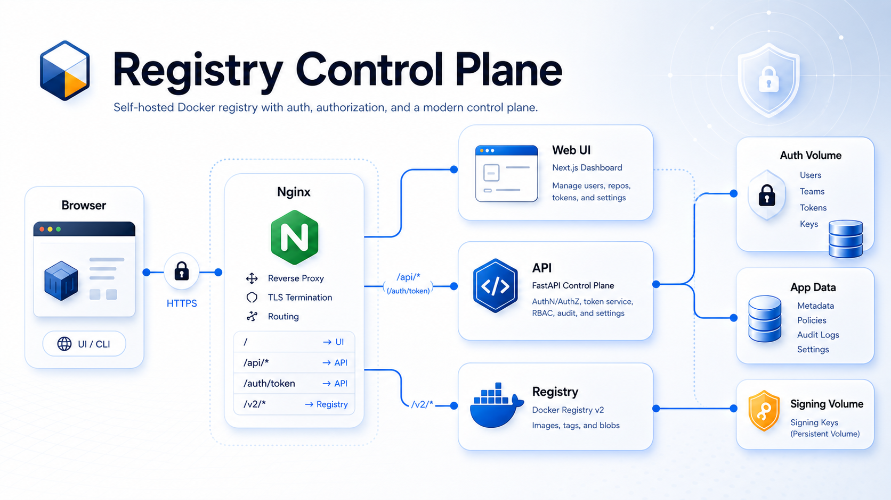

# Registry Control Plane

Phase 3 scaffolding for a self-hosted Docker Registry control plane. This stack provides:

- `nginx` as the front door on `http://localhost:8080`
- `registry:2` behind `/v2/`
- a FastAPI backend behind `/api/*`, `/auth/token`, and `/healthz`
- a Next.js dashboard UI behind `/`
- SQLite-backed app data persisted in a Docker volume
- RS256-signed registry bearer tokens for Docker auth



## Current status (May 7, 2026)

- Signing keys are no longer stored in git. First install generates `auth-private.pem` into the private auth volume and `auth-cert.pem` into the public auth volume.
- Compose startup now runs the `auth-init` task before `api` and `registry` so token-signing material exists before auth traffic.
- Production Docker deployments now start locked when setup is incomplete. Use the first-boot wizard with the one-time setup token from `auth-init` logs, or provide the full `.env` bootstrap values to skip the wizard.
- The stack now runs with non-root `api`, `web`, `registry`, and `nginx` services plus read-only filesystem hardening where practical.
- Dashboard and tag/history reads are bounded to avoid unbounded registry fan-out on large catalogs.
- Docker-backed end-to-end verification is currently passing with `ALLOW_DEV_DEFAULT_CREDENTIALS=1 ./scripts/e2e-test.sh`.

## Local development

The supported packaged workflow is the Docker stack. For local Docker work, use the base compose file plus `docker-compose.local.yml`, which switches the app into development mode and sets:

- `APP_ENV=development`
- `PUBLIC_REGISTRY_ORIGIN=http://localhost:8080`
- `SESSION_COOKIE_SECURE=false`
- `FORWARDED_ALLOW_IPS=*`

Build and start the local Docker stack with explicit local bootstrap values:

```bash
ADMIN_USERNAME=admin \
ADMIN_PASSWORD='set-a-local-password' \
ADMIN_EMAIL=admin@example.com \
docker compose -f docker-compose.yml -f docker-compose.local.yml up --build
```

For local-only convenience, you can opt into the documented bootstrap defaults:

```bash
ALLOW_DEV_DEFAULT_CREDENTIALS=1 \
docker compose -f docker-compose.yml -f docker-compose.local.yml up --build
```

Opt-in defaults:

- username: `admin`
- password: `change-me-now`
- email: `admin@example.com`

If you omit admin bootstrap values, the stack stays in setup mode. Read the `auth-init` container logs, open `http://localhost:8080/setup`, and enter the one-time setup token, first admin account, and local registry origin `http://localhost:8080`.

For a persistent packaged deployment, start by copying the example environment file:

```bash
cp .env.example .env
```

Rebuild images and replace running containers after code changes:

```bash
./scripts/rebuild-stack.sh
```

That command can start in first-boot setup mode with no credentials. Use `ALLOW_DEV_DEFAULT_CREDENTIALS=1 ./scripts/rebuild-stack.sh` only when you intentionally want the documented local admin defaults.

Run the end-to-end smoke test:

```bash
ALLOW_DEV_DEFAULT_CREDENTIALS=1 \
./scripts/smoke-test.sh
```

Run the extended Docker-backed end-to-end verification:

```bash
ALLOW_DEV_DEFAULT_CREDENTIALS=1 \
./scripts/e2e-test.sh
```

Open the UI:

```text
http://localhost:8080/
```

Useful endpoints:

- `GET /healthz` through nginx: `http://localhost:8080/healthz`
- `GET /api/healthz` through nginx: `http://localhost:8080/api/healthz`
- `GET /auth/token` through nginx: `http://localhost:8080/auth/token`
- `GET /v2/` through nginx: `http://localhost:8080/v2/`
- `GET /metrics` directly from the API process: `http://127.0.0.1:8000/metrics` in local direct-run mode

## Local Node workflow

Use Node `20.x`. If you use `nvm`:

```bash
source "$HOME/.nvm/nvm.sh"
nvm use 20
npm install
```

Run the full app outside Docker:

```bash
npm run dev
```

This starts both:

- Next.js on `http://localhost:3000`
- FastAPI on `http://127.0.0.1:8000`

The Next.js dev server is configured to talk to the local FastAPI process automatically.
`npm run dev` shells out to `./scripts/dev-api.sh` for the backend, so `.venv` must already exist and contain the backend dependencies.

## Local Python workflow

This repository uses a Python virtual environment at `.venv` for all backend work.
The checked-in test toolchain currently expects Python `3.10+`; this checkout is pinned to `3.11.9` via `.python-version`.

Create and activate it if you have not already:

```bash
python3 -m venv .venv
source .venv/bin/activate
pip install -r backend/requirements.txt
```

With `.venv` active, run only the API directly:

```bash
uvicorn backend.main:app --reload
```

Or use the same backend launcher that `npm run dev` uses:

```bash
ALLOW_DEV_DEFAULT_CREDENTIALS=1 ./scripts/dev-api.sh
```

Default local backend data is stored in `.local-data/app.db`. Inside Docker, the API uses `/data/app.db`.

Run backend tests:

```bash
source .venv/bin/activate
pytest backend/tests
```

Run Docker CLI integration tests for the Phase 4 permission matrix:

```bash
source .venv/bin/activate
pytest tests/integration/test_docker_cli.py
```

Run the compose/runtime hardening regression checks:

```bash
source .venv/bin/activate
pytest tests/integration/test_container_hardening_files.py
```

Run Alembic migrations manually:

```bash
source .venv/bin/activate
alembic -c backend/alembic.ini upgrade head
```

The API container now applies Alembic migrations automatically on startup before serving requests.

Run frontend smoke tests:

```bash
npm test
```

## Forgejo Actions

The repository includes a workflow at `.forgejo/workflows/docker.yml` that validates the Docker image build for `linux/amd64` on pull requests, pushes to `master`, `development`, `release`, `v*` tags, and manual dispatches.

The workflow builds the `api`, `auth-init`, and `web` Dockerfile targets through `docker buildx bake validate-amd64`. It does not log in to a registry and does not push images.

It expects a Forgejo runner with the `docker-build` label, Docker access, and outbound access to the npm and PyPI package registries.

## Packaging and upgrade path

The Docker stack is the supported package format for this project.

Deployment shape:

- copy `.env.example` to `.env`
- leave `PUBLIC_REGISTRY_ORIGIN`, `ADMIN_USERNAME`, `ADMIN_PASSWORD`, and `ADMIN_EMAIL` blank to use the first-boot wizard
- or set all four values to complete first-boot setup automatically from `.env`
- review `TOKEN_ISSUER`, `TOKEN_SERVICE`, `TOKEN_TTL_SECONDS`, `SESSION_COOKIE_SECURE`, `CSRF_TRUSTED_ORIGINS`, `FORWARDED_ALLOW_IPS`, and `RCP_HTTP_BIND`
- start with `docker compose up --build -d`

Useful packaging notes:

- `docker compose` automatically reads `.env`
- the base compose file defaults to `APP_ENV=production`, `SESSION_COOKIE_SECURE=true`, and a localhost-only nginx bind
- production starts in locked setup mode when no admin or saved registry origin exists
- while setup is incomplete, login, admin APIs, repository APIs, and registry-token issuance return controlled setup-required errors
- the first-boot setup token is generated by `auth-init`, stored only as a SHA-256 hash in the private app-data volume, and printed once in `auth-init` logs
- production registry origins must use `https://`; only local development allows `http://localhost:8080`
- full `.env` bootstrap requires all four values: `ADMIN_USERNAME`, `ADMIN_PASSWORD`, `ADMIN_EMAIL`, and `PUBLIC_REGISTRY_ORIGIN`
- local Docker runs should include `docker-compose.local.yml`, which switches cookies and app mode back to development
- `auth-init` renders the initial registry config, prepares ownership, generates signing material on first install, and generates the one-time setup token when needed
- the API container now runs `alembic upgrade head` on boot
- services use `restart: unless-stopped`
- external container images are pinned to fixed tags instead of floating tags
- persistent state lives in the named Docker volumes `app-data`, `registry-data`, `auth-private-data`, `auth-public-data`, and `registry-config-data`
- nginx publishes the host bind to container port `8080`, not port `80`, because the runtime now stays non-root end-to-end

First-boot wizard flow:

```bash
docker compose up --build -d
docker compose logs auth-init
```

Open `/setup` at the public origin, enter the one-time setup token from the logs, create the first admin, and save the public registry origin. After setup completes, restart only the registry so it reloads the rendered auth realm:

```bash
docker compose restart registry
```

For automated production bootstrap, set all four setup values in `.env` before first start:

```dotenv
PUBLIC_REGISTRY_ORIGIN=https://registry.example.com
ADMIN_USERNAME=admin
ADMIN_PASSWORD=replace-with-a-long-random-password
ADMIN_EMAIL=admin@example.com
```

After setup, the saved registry origin in SQLite is the source of truth. Changing `PUBLIC_REGISTRY_ORIGIN` in `.env` later does not override the saved value; update it from `/admin/settings`, then run `docker compose restart registry`.

Before an upgrade:

```bash
./scripts/backup-db.sh
```

To rebuild and apply an upgrade:

```bash
./scripts/upgrade-stack.sh
```

That workflow:

- copies `/data/app.db` out of the running API container
- rebuilds the images
- recreates the stack
- lets the API apply migrations on startup

If you only need to refresh containers after source changes without treating it as an upgrade step, `./scripts/rebuild-stack.sh` is still fine.

## Release workflow

This repo uses three long-lived branches:

- `development` for day-to-day integration work
- `master` for the current stable branch head
- `release` for release tagging

Set up the local release branch once:

```bash
git switch development
git switch -c release
```

For each release:

```bash
git switch master
git merge --ff-only development
git switch release
git merge --ff-only development
./scripts/release-tag.sh patch
```

To publish the tag to `origin`:

```bash
./scripts/release-tag.sh patch --push
```

The release helper:

- creates annotated `vMAJOR.MINOR.PATCH` tags
- defaults to tagging from the `release` branch
- refuses dirty worktrees unless `--force-dirty` is passed
- supports `major`, `minor`, `patch`, or an explicit version
- supports `--dry-run` for validation without creating a tag

Validation examples:

```bash
bash -n ./scripts/release-tag.sh
./scripts/release-tag.sh patch --dry-run --allow-branch --force-dirty
./scripts/release-tag.sh 1.0.0 --dry-run --allow-branch --force-dirty
```

## Notes

- Browser login is implemented and registry token issuance is now backed by signed JWTs.
- FastAPI now owns the identity model, PATs, robot tokens, repository permissions, audit schema, and registry bearer-token issuance.
- Next.js owns the UI rendering and dashboard UX only.
- Registry garbage collection now uses a maintenance gate on `/v2/` rather than stopping the registry container.
- The maintenance UI and `/v2/` gate are exercised by `./scripts/e2e-test.sh`, including live delete and garbage-collection flows.
- `docker compose build` alone does not refresh already-running containers; use `./scripts/rebuild-stack.sh` when you need the live stack to pick up new code.
- On first run, the backend either completes setup from the full `.env` bootstrap values or stays locked behind the one-time setup-token wizard.
- Registry signing material is generated on first install into the Docker volumes `auth-private-data` and `auth-public-data`.
- Repository catalog, dashboard fan-out, tag lists, and history responses are intentionally capped by environment-configurable limits to keep the control plane responsive on larger registries.
- Login and registry-token issuance now have configurable fixed-window rate limits.
- To supply your own signing keypair, mount the private key to `/run/auth-private/auth-private.pem` and the public certificate to `/run/auth-public/auth-cert.pem` in the API container. Mount only the public certificate at `/certs/auth-cert.pem` in the registry container.
- The registry is reachable directly only through nginx routing.
